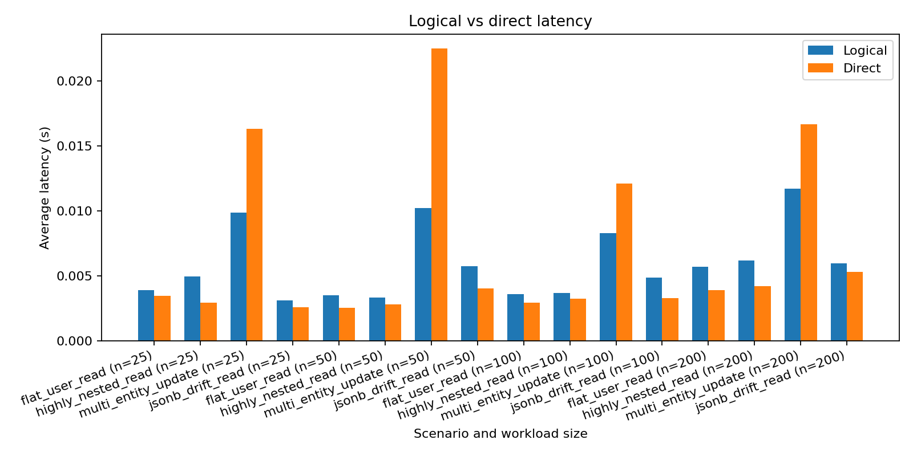
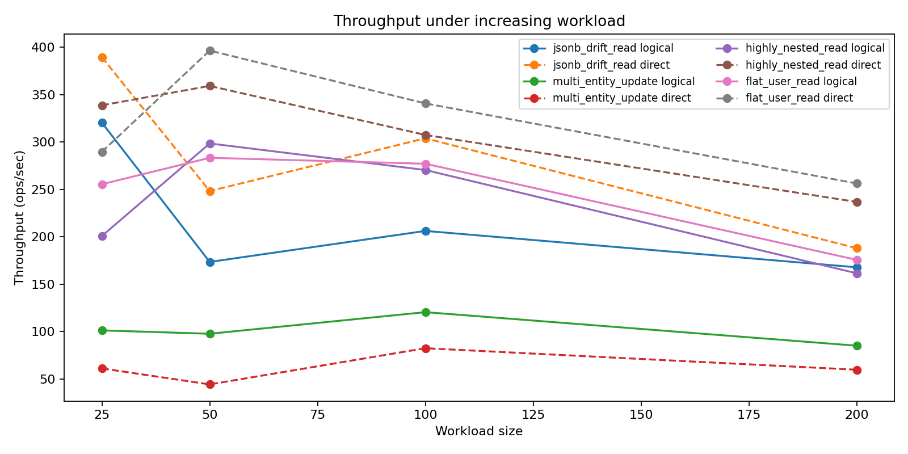

# CS 432 Databases (Track 2) - Assignment 4 Final Report

## First Page Details

**GitHub Repository Link:** https://github.com/devansh-lodha/chiral-db/

**Video Demonstration Link:** final_video_demo_link

---

## 1. Project Objective

This assignment completes the ChiralDB project as a logical database framework that:

1. Provides a clean, logical interface over hybrid data storage.
2. Improves dashboard usability for session-oriented data inspection and query execution.
3. Quantifies framework performance using reproducible benchmarking experiments.
4. Compares framework-level logical queries against direct database access.
5. Packages the entire system for reproducible deployment and execution.

ChiralDB implements a single-engine hybrid strategy over PostgreSQL with relational columns and JSONB-backed overflow paths, while preserving a logical abstraction for users.

---

## 2. System Overview and Core Pipeline

ChiralDB pipeline used in this assignment:

1. **Adaptive ingestion:** records are inserted into session-scoped staging and then analyzed/migrated.
2. **Metadata-driven schema evolution:** dynamic schema inference and decomposition plans are recorded in metadata.
3. **Logical query execution:** CRUD requests are translated into SQL with joins and JSONB path extraction.
4. **Transaction coordination:** multi-entity logical operations are coordinated in ACID transactions.
5. **Dashboard interaction:** users work through logical session/entity views without manual SQL writing.

The final architecture uses:

- FastAPI backend service.
- Python Chiral client and query service.
- PostgreSQL database (including JSONB for unstructured/nested data).
- React dashboard frontend.
- Benchmark and comparison scripts with JSON outputs and PNG plots.

---

## 3. Dashboard Enhancement

### 3.1 Implemented Enhancements

The dashboard includes the following major capabilities required for Assignment 4:

1. **Viewing active sessions**
   - Session dropdown populated from active backend sessions.
   - Session context switching updates schema and metadata-driven UI state.

2. **Listing logical entities in a session**
   - Entity Inspector renders a logical tree from inferred logical fields.
   - Nested dotted paths are grouped and expandable.

3. **Viewing instances of each entity**
   - Query result tabs render row-level logical object instances.
   - Nested objects are rendered with expandable JSON viewers.

4. **Inspecting field names and values**
   - Read operations support user-selected logical fields.
   - Results table displays reconstructed logical records and field values.

5. **Displaying executed logical query results**
   - Each successful CRUD operation creates a new result tab.
   - Metadata includes timestamp, row count / affected rows, and payload details.

6. **Query execution inspection support**
   - SQL details (generated SQL + bound parameters) are available via details toggle.
   - Helps verify logical-to-physical translation while keeping default UX logical-first.

### 3.2 UI/UX Notes

1. Session status widget shows:
   - engine status,
   - record count,
   - schema version.
2. Filter builder supports dynamic condition rows.
3. Update operation uses key-value update builder for safer logical updates.
4. Errors are surfaced with dismissible error banners.
5. Result tabs are closable and timestamped.

### 3.3 Known Dashboard Limitation

A dedicated persistent query-history panel is not yet implemented. Current query history exists as in-memory result tabs for the active browser session.

---

## 4. Performance Evaluation

### 4.1 Experiment Goals

Experiments were designed to evaluate:

1. Logical query/update latency under increasing workload size.
2. Throughput behavior of logical abstraction versus direct database access.
3. Query processing overhead introduced by the logical abstraction layer.
4. Scenario-specific behavior for flat reads, nested reads, multi-entity updates, and JSONB-drift reads.

### 4.2 Benchmark Setup

- **Primary script:** scripts/performance_comparison.py
- **Result files used:**
   - benchmark-results/comparison_results.json
- **Session ID:** a4
- **Profile:** full
- **Workload sizes:** 25, 50, 100, 200
- **Trials per size per scenario:** 5

Benchmark dimensions measured from comparison_results.json:

1. average latency (logical vs direct),
2. p50 and p95 latency per scenario/phase,
3. throughput (ops/s) per scenario/phase,
4. latency overhead seconds and overhead percent,
5. throughput delta (logical minus direct),
6. win counts across all scenario-size points.

### 4.3 Performance Results (From comparison_results.json)

| Metric | Value |
| --- | --- |
| Logical average latency | 0.0059 s |
| Direct average latency | 0.0068 s |
| Logical latency wins | 4 / 16 |
| Logical throughput wins | 4 / 16 |

### 4.4 Scenario-Level Aggregates (Computed from comparison_results.json)

| Scenario | Logical Avg Latency (s) | Direct Avg Latency (s) | Avg Overhead (%) | Avg Throughput Delta (ops/s) |
| --- | ---: | ---: | ---: | ---: |
| flat_user_read | 0.0042 | 0.0032 | +30.51 | -72.84 |
| highly_nested_read | 0.0046 | 0.0033 | +37.28 | -77.67 |
| multi_entity_update | 0.0100 | 0.0169 | -38.84 | +39.21 |
| jsonb_drift_read | 0.0049 | 0.0038 | +30.98 | -65.37 |

Latency overhead by workload size (percentage):

- flat_user_read: +13.36, +39.89, +22.96, +45.82
- highly_nested_read: +68.60, +20.32, +13.66, +46.54
- multi_entity_update: -39.54, -54.58, -31.52, -29.73
- jsonb_drift_read: +21.53, +43.05, +47.34, +11.99

Interpretation:

1. Abstraction overhead is highest for flat reads and moderate for nested reads.
2. Multi-entity update performance now clearly favors the logical path in all tested workload sizes.
3. Throughput gap remains large in read-heavy paths, while logical throughput leads in coordinated update paths.

### 4.5 Key Observations

1. Overall logical average latency is lower than direct average latency in this run because multi-entity updates are substantially faster through the framework path.
2. The abstraction cost is workload dependent: read-heavy scenarios still show overhead, while coordinated writes show a net gain.
3. JSONB drift workloads are now explicitly represented in both measurement and analysis.

---

## 5. Comparative Analysis: Logical Framework vs Direct Database Access

### 5.1 Comparative Experiment Design

- **Primary script:** scripts/performance_comparison.py
- **Profiles / scenarios:** full profile with
  1. flat_user_read,
  2. highly_nested_read,
   3. multi_entity_update,
   4. jsonb_drift_read.
- **Workload sizes:** 25, 50, 100, 200
- **Trials per point:** 5
- **Result files used:**
  - benchmark-results/comparison_results.json
  - benchmark-results/comparison_summary.md

### 5.2 Aggregate Summary

From comparison summary:

- Logical average latency: **0.0059 s**
- Direct average latency: **0.0068 s**
- Logical latency wins: **4/16**
- Logical throughput wins: **4/16**

### 5.3 Scenario-Wise Results

#### A. flat_user_read (logical read vs direct SQL)

- Overhead across sizes:
   - size 25: +13.36%
   - size 50: +39.89%
   - size 100: +22.96%
   - size 200: +45.82%

Interpretation:

1. Logical abstraction adds measurable overhead for flat reads.
2. Cost comes from query translation + abstraction machinery not needed in direct SQL.

#### B. highly_nested_read (logical nested path vs direct SQL JSONB extraction)

- Moderate overhead, relatively stable:
   - size 25: +68.60%
   - size 50: +20.32%
   - size 100: +13.66%
   - size 200: +46.54%

Interpretation:

1. Overhead exists, but proportionally lower than flat reads in many sizes.
2. Logical API simplifies nested-access development despite runtime premium.

#### C. multi_entity_update

- Logical path outperforms direct SQL in all tested sizes:
   - size 25: -39.54% (logical faster)
   - size 50: -54.58% (logical faster)
   - size 100: -31.52% (logical faster)
   - size 200: -29.73% (logical faster)

Interpretation:

1. For complex write coordination across entities, logical abstraction can be competitive.
2. In this benchmark run, framework-level coordination consistently outperformed direct SQL sequences.

#### D. jsonb_drift_read (logical JSONB-drift read vs direct JSONB query)

- Overhead across sizes:
   - size 25: +21.53%
   - size 50: +43.05%
   - size 100: +47.34%
   - size 200: +11.99%

Interpretation:

1. Direct JSONB extraction remains faster in read-heavy drift scenarios.
2. The logical API still provides a uniform access path for mixed-type fields without requiring manual SQL JSONB expressions.

### 5.4 Throughput Trend Under Increasing Workload

Throughput graphs in results show:

1. Direct SQL/JSONB generally leads in read-heavy scenarios (flat, nested, and drift reads).
2. Logical throughput is stronger for multi-entity coordinated updates.
3. Framework throughput remains stable while preserving a single logical query interface.

### 5.5 Comparative Visualizations

### Latency Comparison Plot

### Throughput Comparison Plot

### 5.6 Trade-off Discussion (Abstraction vs Performance)

Where abstraction introduces overhead:

1. Flat read queries with simple projections/filters.
2. High-frequency, latency-sensitive nested/JSONB read paths requiring minimal translation.

Where abstraction helps and can justify overhead:

1. Rapid application development without hand-crafted SQL per entity shape.
2. Nested-object handling under schema evolution.
3. Unified API for mixed structured/unstructured updates.
4. Strong write-path performance for coordinated multi-entity updates in this benchmark run.
5. Reduced cognitive load for developers using logical object interfaces.

---

## 6. Final System Packaging and Reproducibility

This section addresses assignment packaging requirements.

### 6.1 Source Code Repository

- Project delivered as a versioned source repository.
- Repository includes:
  - src implementation,
  - web dashboard,
  - tests,
  - docs,
  - benchmark and comparison scripts,
  - benchmark artifacts.
- ChiralDB is also published on PyPI, making it directly installable and usable by external users beyond this course repository.
- PyPI publication provides a packaged distribution of the client and framework modules so users can integrate logical ingestion/query features into their own Python projects without cloning the full source tree.

---

## 7. System Limitations

1. **Persistent query history UI is not yet implemented**
   - Current query history is session-local in-memory tabs.

2. **Performance overhead on simple reads**
   - Abstraction layer introduces measurable latency for flat read workloads.

---

## 8. Conclusion

Assignment 4 objectives were addressed through:

1. A significantly enhanced dashboard for logical session-driven interaction,
2. quantitative performance benchmarking across ingestion/query/metadata/coordination paths,
3. comparative analysis against direct database access using multiple workload sizes and trials,
4. complete packaging and reproducibility instructions.

Results show a clear and expected trade-off: direct SQL is faster in simple read paths, while ChiralDB provides substantial abstraction benefits and remains competitive in coordinated multi-entity update workflows.

Overall, the delivered system demonstrates a complete logical database layer that is usable, measurable, and reproducibly deployable for course-project evaluation.

---
